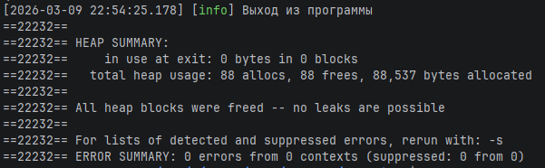
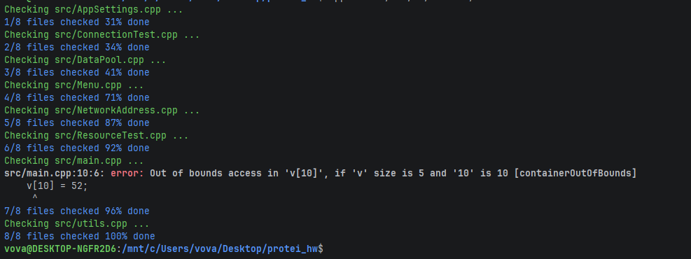

## Владимир Артикуленко

## Запуск

Для сборки обязательно нужно установить liburing и pkg-config

``` 
sudo apt install liburing-dev pkg-config
cmake .
cmake --build .
```

Клиент
``` 
./myApp_client -a 127.0.0.. -p 8080
```
Сервер
```
./myApp_server
```

Запуск
``` 
./myApp_server -p 8080
./myApp_client -i 127.0.0.1 -p 8080
```
## Работа в меню

1. вводим вектор (например так)
```add_vector int 5 1 2 3 4 5```
но можно и так
``` 
add_vector
int
5
1 2 3 4 5
```
2. после адд_вектор команду в ту же строку писать нельзя, потому что буфер после чисел очищается
3. отправляем данные на сервер
``` 
send_vector
```
4. Получаем результат, например
``` 
Результат: 1 4 9 16 25
```
5. Опционально - ```print_vector``` чтобы проверить что в вектор записалось то что надо

## Что делает программа?

### Сервер

1. Создает сервер на порту 8080
2. Принимает вектор и считает его сумму
3. поддерживает пингпонг проверку соединения

### Клиент

1. Подключается к серверу
2. Ввод вектора
3. Отправка вектора
4. пингпонг проверка соединения

## Санитайзер + cppcheck




## Ошибки, критичные для программы

1. Отсутсвтие айпи адреса или порта

## Ошибки, некритичные для программы

1. Отсутствие псевдонима - программа продолжит работу с пустым значением
2. Отсутствие флага `-i` - используется значение по умолчанию
3. Отсутствие флага `-L` - библиотека не подгружается, основной функционал сохраняется

### Линтер

```
cpplint --recursive --exclude=build/* --exclude=CMakeFiles/* --filter=-legal/copyright .
```


## Запуск проекта


```
chmod +x test.sh
./test.sh
```

или

```
cmake .
cmake --build .
./myApp -p <порт> -a <айпи адрес> -r <роль> -i <и> -L <библиотека>
```

или 
```
valgrind --leak-check=full ./myApp -a 255.0.0.1 -p 999 -r Client -i 0 -L mylib
```
